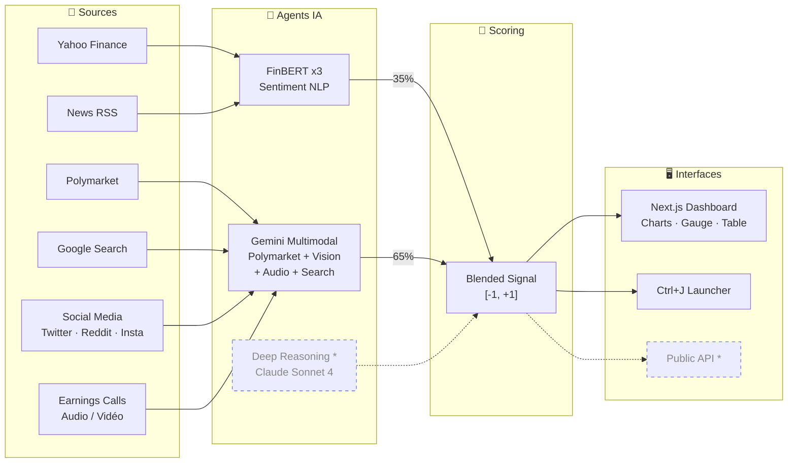

# 📘 FEELOW — Documentation Technique Complète V1

> **Version :** HackEurope 2026  
> **Stack :** Python · FastAPI · Next.js · React · Plotly · Recharts · PyTorch · HuggingFace · Gemini · yfinance  
> **Architecture :** Backend FastAPI + Webapp Next.js + Desktop Launcher  

---

## Table des matières

1. [Vue d'ensemble](#1-vue-densemble)
2. [Architecture globale](#2-architecture-globale)
3. [Sources de données temps réel](#3-sources-de-données-temps-réel)
4. [Pipeline multi-agents](#4-pipeline-multi-agents)
5. [Sentiment NLP — Ensemble FinBERT](#5-sentiment-nlp--ensemble-finbert)
6. [Polymarket Intelligence Pipeline](#6-polymarket-intelligence-pipeline)
7. [Scoring mathématique propriétaire](#7-scoring-mathématique-propriétaire)
8. [Agent Gemini Multimodal](#8-agent-gemini-multimodal)
9. [Agentic Pipeline — Orchestrateur](#9-agentic-pipeline--orchestrateur)
10. [Webapp Next.js — Dashboard](#10-webapp-nextjs--dashboard)
11. [Desktop Launcher (Ctrl+J)](#11-desktop-launcher-ctrlj)
12. [API REST & endpoints](#12-api-rest--endpoints)
13. [Schéma d'architecture Mermaid](#13-schéma-darchitecture-mermaid)
14. [Roadmap & features à venir](#14-roadmap--features-à-venir)
15. [Équipe](#15-équipe)

---

## 1. Vue d'ensemble

Feelow est une **plateforme d'intelligence de marché cross-market** qui détecte les écarts entre ce que "prédit" le collectif sur les prediction markets (Polymarket) et ce que reflètent les marchés financiers réels.

**L'idée centrale :** les prediction markets condensent des croyances et anticipations (probabilités, volumes, variations rapides). En parallèle, les marchés actions intègrent ces informations avec latence, bruit ou biais. Feelow fusionne ces signaux pour produire un **Market Mispricing Score** : l'action semble-t-elle sur-valorisée ou sous-valorisée par rapport aux attentes implicites du marché événementiel ?

### Pitch 20 secondes

> On fusionne en temps réel des données cross-market — Polymarket, Yahoo Finance, Google Search, réseaux sociaux, earnings calls audio — via 5 agents IA autonomes en mode tool-use : ingestion, normalisation, scoring, validation/cross-check, puis génération d'un brief explicable grâce à Gemini multimodal. Le sentiment est scoré par un ensemble de 3 modèles FinBERT fine-tunés issus de la recherche académique, basé sur un système de consensus majoritaire — F1 jusqu'à 98%. Data viz interactive, scoring mathématique propriétaire, APIs live, zéro donnée statique.

---

## 2. Architecture globale

```
feelow/
├── backend/                    # FastAPI server + pipelines
│   ├── src/
│   │   ├── main.py             # FastAPI app — tous les endpoints
│   │   ├── full_pipeline.py    # Glue agent-search ↔️ scoring
│   │   ├── agent_search/       # Recherche Polymarket via Gemini + MCP
│   │   │   ├── orchestrator.py       # Orchestrateur multi-agents
│   │   │   ├── polymarket_pipeline.py # Gemini forced tool-calling
│   │   │   ├── polymarket_api.py      # Client API Polymarket CLOB
│   │   │   ├── schema.py             # Item, Bundle dataclasses
│   │   │   ├── prompts.py            # Prompts LLM (summary, router, synthesis)
│   │   │   ├── router.py             # Sélection intelligente d'items
│   │   │   ├── synthesis.py          # Synthèse narrative
│   │   │   ├── collectors/
│   │   │   │   ├── local_images.py   # Reddit, Twitter, Instagram, Trends
│   │   │   │   └── local_video.py    # Earnings call vidéo
│   │   │   └── scoring/
│   │   │       ├── reliability.py    # Score de fiabilité source
│   │   │       ├── relevance.py      # Score de pertinence
│   │   │       ├── novelty.py        # Score de nouveauté
│   │   │       ├── sentiment.py      # Score de sentiment
│   │   │       └── impact.py         # Score d'impact marché
│   │   ├── polymarket-analysis/
│   │   │   └── score_polymarket.py   # Market class, métriques avancées
│   │   └── finance-data/
│   │       ├── agent_orchestrator.py # Orchestrateur pipeline agentic
│   │       ├── sentiment_engine.py   # FinBERT x3 ensemble
│   │       ├── news_ingestor.py      # RSS + Finviz scraping
│   │       ├── market_data.py        # yfinance OHLCV
│   │       ├── technicals.py         # RSI, MACD, Bollinger, SMA
│   │       ├── gemini_agent.py       # Gemini vision + search + reasoning
│   │       └── claude_analyst.py     # Claude tool-use (à venir)
│   ├── agentic_pipeline.py           # Pipeline Gemini multimodal complet
│   ├── demo_assets/                  # Assets démo (images sociales, vidéo earnings)
│   └── tests/
├── webapp/                     # Next.js React dashboard
│   └── UI-fr/
│       ├── app/                # Pages Next.js (App Router)
│       │   ├── page.tsx        # Redirect → /dashboard
│       │   └── dashboard/
│       │       └── page.tsx    # Dashboard principal
│       ├── components/         # Composants React
│       │   ├── section-cards.tsx          # KPI cards (prix, sentiment, gauge)
│       │   ├── chart-area-interactive.tsx # Charts (area, candlestick, indicators)
│       │   ├── data-table.tsx            # Table news + Polymarket bets
│       │   ├── app-sidebar.tsx           # Navigation sidebar
│       │   ├── site-header.tsx           # Header
│       │   └── ui/                       # 30+ composants shadcn/ui
│       │       ├── gauge.tsx             # Jauge investment signal [-1,+1]
│       │       ├── chart.tsx             # Recharts wrapper
│       │       ├── combobox.tsx          # Ticker search
│       │       └── ...
│       └── lib/
│           └── ticker-context.tsx        # React Context (ticker + Polymarket state)
├── launcher/                   # Desktop launcher Ctrl+J
│   └── launcher.py             # customtkinter floating card
└── frontend/                   # Streamlit dashboard (legacy)
    └── app.py
```

---

## 3. Sources de données temps réel

Toutes les données sont **live** — zéro donnée statique, zéro CSV.

| Source | API / Méthode | Données | Cache |
|--------|--------------|---------|-------|
| **Yahoo Finance** | `yfinance` Python | OHLCV, prix, volume, fondamentaux, market cap | TTL 2 min |
| **Yahoo RSS** | `feedparser` | Headlines financières temps réel | TTL 5 min |
| **Finviz** | Scraping HTML | Headlines fallback (si Yahoo < 5 articles) | TTL 5 min |
| **Polymarket** | API CLOB REST | Marchés de prédiction, odds, historique prix, liquidité | TTL 10 min |
| **Google Search** | Gemini Search Grounding | Actualités live, consensus analystes, catalysts | Par requête |
| **Réseaux sociaux** | Collectors locaux (démo) | Images Twitter/X, Reddit, Instagram, Google Trends | — |
| **Earnings Calls** | Collector vidéo local | Vidéo/audio earnings calls CEO | — |

### Univers d'assets supporté

- 🖥️ **Tech** : NVDA, TSLA, AAPL, AMZN, MSFT, GOOGL, META, AMD, NFLX
- 🏦 **Finance** : JPM, GS, BAC, COIN
- 🪙 **Crypto** : BTC-USD, ETH-USD, SOL-USD
- ✏️ **Custom** : n'importe quel ticker via input libre

---

## 4. Pipeline multi-agents

Le backend orchestre **5 agents spécialisés** travaillant en séquence :

| # | Agent | Rôle | Technologie |
|---|-------|------|-------------|
| 1 | **Data Assembly** | Collecte prix OHLCV, news RSS, indicateurs techniques | yfinance, feedparser, BeautifulSoup |
| 2 | **Sentiment Ensemble** | Classification du sentiment par vote de 3 modèles FinBERT | PyTorch, HuggingFace Transformers |
| 3 | **Polymarket Intelligence** | Recherche LLM-guidée de marchés de prédiction + scoring pertinence | Gemini 2.5 Flash, MCP, Polymarket API |
| 4 | **Gemini Multimodal** | Analyse visuelle de charts, analyse audio earnings, search grounding | Gemini 2.0 Flash (vision + audio + search) |
| 5 | **Deep Reasoning** *(à venir)* | Raisonnement autonome avec tool-use pour rapport final | Claude Sonnet 4 |

Chaque agent reporte : **statut** (completed/failed/skipped), **durée** (ms), **résultat détaillé**. Traçabilité totale.

---

## 5. Sentiment NLP — Ensemble FinBERT

### Fondement scientifique

Les 3 modèles sont basés sur **BERT** (Devlin et al., 2019), fine-tunés sur le **Financial PhraseBank** (Malo et al., 2014) — un corpus de ~4 800 phrases financières annotées par 16 experts.

### Modèles déployés

| Modèle | HuggingFace ID | F1 Score | Entraînement | Architecture |
|--------|---------------|----------|-------------|-------------|
| **FinBERT (ProsusAI)** | `ProsusAI/finbert` | ~87% | Financial PhraseBank | BERT-base (12 layers, 768 dim, 12 heads) |
| **FinBERT-Tone** | `nickmuchi/finbert-tone` | ~90% | Analyst reports fine-tune | BERT-base + tone detection |
| **Sigma Financial SA** | `Sigma/financial-sentiment-analysis` | ~98% | Financial PhraseBank | BERT-base, highest accuracy |

### Processus d'inférence

Pour chaque headline $h$ :

1. **Tokenization** : $h \rightarrow [\text{CLS}] \; t_1 \; t_2 \; \ldots \; t_n \; [\text{SEP}]$ (WordPiece, vocabulaire 30 522 tokens)
2. **Embedding** : chaque token → vecteur de dimension 768
3. **12 couches Transformer** avec self-attention multi-tête :
$$\text{Attention}(Q, K, V) = \text{softmax}\left(\frac{QK^T}{\sqrt{d_k}}\right)V$$
4. **Pooling** : vecteur du token [CLS] (dim 768) comme représentation de la phrase
5. **Classification linéaire** : $\text{logits} = W \cdot h_{[\text{CLS}]} + b$ où $W \in \mathbb{R}^{3 \times 768}$
6. **Softmax** : $P(\text{label}_i) = \frac{e^{\text{logits}_i}}{\sum_j e^{\text{logits}_j}}$
7. **Résultat** : label `{positive, neutral, negative}` + probabilité de confiance

### Système de vote par consensus

Les 3 modèles votent indépendamment pour chaque headline :

$$\text{ensemble\_score}(h) = \frac{1}{3} \sum_{m=1}^{3} s_m(h)$$

où $s_m(h) \in \{-1, 0, +1\}$ = score numérique du modèle $m$.

**Règle de majorité :** il faut qu'au moins **2 modèles sur 3** s'accordent pour qu'un signal positif ou négatif émerge :

$$\text{label} = \begin{cases} \text{positive} & \text{si } \text{score} > 0.33 \\ \text{negative} & \text{si } \text{score} < -0.33 \\ \text{neutral} & \text{sinon} \end{cases}$$

**Avantage du consensus :** un seul modèle se trompe souvent. Trois modèles votant ensemble réduisent drastiquement les faux signaux.

### Seuils de signaux trading

```
STRONG BUY   : sentiment > +0.40
BUY          : sentiment > +0.10
NEUTRAL      : -0.10 ≤ sentiment ≤ +0.10
SELL         : sentiment < -0.10
STRONG SELL  : sentiment < -0.40
```

---

## 6. Polymarket Intelligence Pipeline

### Step 1 — Agent Search (Gemini + MCP)

Le pipeline utilise **Gemini 2.5 Flash** avec **forced tool-calling** via le protocole **MCP (Model Context Protocol)** :

1. Gemini génère des requêtes de recherche variées à partir du nom de l'entreprise
2. Chaque requête appelle l'outil `search_with_history` sur l'API Polymarket CLOB
3. L'API retourne les marchés de prédiction avec leur historique de prix complet
4. Gemini score la **pertinence** de chaque marché (0–100) via **structured output** (Pydantic `ScoringResult`)

### Step 2 — Advanced Scoring

Chaque marché trouvé est transformé en objet `Market` et analysé quantitativement. Voir section 7.

### Step 3 — Fusion

Le `full_pipeline.py` connecte les deux étapes :
- Bridge de format : `price_history` (agent-search) → `history` (scoring)
- Normalisation pertinence : échelle 0–100 → 0–1
- Résultat unifié : données brutes + marchés scorés + bloc Claude-ready

---

## 7. Scoring mathématique propriétaire

### Métriques simples (par marché)

| Métrique | Formule | Normalisation |
|----------|---------|---------------|
| **Momentum** | $\lvert p_{\text{last}} - p_{\text{first}} \rvert$ | [0, 1] |
| **Volatility** | $p_{\max} - p_{\min}$ sur l'historique | [0, 1] |
| **Concentration** | $1 - \frac{H(p)}{\log(n)}$ (entropie normalisée inverse) | [0, 1] |
| **Volume** | $\frac{\log(\text{volume} + 1)}{12}$ | [0, 1] |
| **Liquidity** | $\frac{\log(\text{liquidité} + 1)}{10}$ | [0, 1] |
| **Pertinence** | Score LLM brut (0–1) | [0, 1] |

### Score final pondéré

$$\text{score} = 0.25 \cdot \text{momentum} + 0.15 \cdot \text{volatility} + 0.20 \cdot \text{concentration} + 0.10 \cdot \text{volume} + 0.10 \cdot \text{liquidity} + 0.20 \cdot \text{pertinence}$$

### Métriques avancées (historique)

| Métrique | Formule | Rôle |
|----------|---------|------|
| **Slope OLS** | Pente des moindres carrés de $p$ vs $t$ (en jours) | Tendance linéaire |
| **Total Variation** | $\sum \lvert \Delta p_i \rvert$ | Activité de repricing |
| **Max Jump** | $\max(\lvert \Delta p_i \rvert)$ | Événement choc |
| **Volatilité $\Delta p$** | $\sigma(\Delta p)$ | Dispersion des changements |
| **Staleness ratio** | Fraction de points à $p \approx 0.5$ | Marché mort ou actif |
| **Entropie binaire** | $H(p) = -(p \log p + (1-p) \log(1-p))$ | Degré d'incertitude |

### History Quality (0–1)

$$\text{HQ} = 0.45 \cdot \tanh\left(\frac{n}{50}\right) + 0.35 \cdot \tanh\left(\frac{h}{24}\right) + 0.20 \cdot (1 - s_{0.5})$$

où $n$ = nombre de points, $h$ = span en heures, $s_{0.5}$ = staleness ratio.

### Composite Signal (-1 à +1)

$$\text{CS} = \underbrace{\text{pertinence} \times \text{HQ} \times \text{liq\_factor} \times (1 - \text{staleness})}_{\text{fiabilité}} \times \underbrace{\tanh(20 \lvert \text{slope} \rvert) \times \tanh(5 \cdot \text{TV})}_{\text{intensité}} \times \text{sign}(\text{slope})$$

Ce signal capture à la fois la **direction** (bullish/bearish) et la **force** du mouvement, pondérée par la fiabilité des données.

### Corrélation inter-marchés

Corrélation de Pearson entre les top 2 marchés :
$$r = \frac{\sum (p_a - \bar{p_a})(p_b - \bar{p_b})}{\sqrt{\sum (p_a - \bar{p_a})^2 \sum (p_b - \bar{p_b})^2}}$$

Détecte la redondance entre marchés ou des co-mouvements significatifs.

### Blended Signal (fusion cross-market)

$$\text{Blended} = 0.35 \times \text{NLP\_sentiment} + 0.65 \times \text{Polymarket\_signal}$$

Si Polymarket est indisponible → fallback automatique à 100% NLP headlines.

### Quality Score par item (Agentic Pipeline)

$$Q = R \times Re \times N \times I \times C$$

où $R$ = reliability, $Re$ = relevance, $N$ = novelty, $I$ = impact, $C$ = confidence.

### Reliable Source Score

$$\text{RSS} = 1 - \prod_{i=1}^{n} (1 - Q_i)$$

### Signal Score final

$$\text{Signal} = \text{avg\_sentiment\_weighted} \times \text{RSS}$$

---

## 8. Agent Gemini Multimodal

Gemini est utilisé en mode **multimodal** pour analyser plusieurs types de médias :

### Vision — Analyse de charts

Gemini 2.0 Flash analyse les images de graphiques financiers et détecte :
- Patterns visuels (head & shoulders, double top, etc.)
- Trend (uptrend / downtrend / sideways)
- Niveaux de support et résistance
- Signal visuel (Bullish / Neutral / Bearish) avec conviction 1-10

### Audio / Vidéo — Earnings Calls

Le collector `EarningsVideoCollector` charge les vidéos d'earnings calls. Gemini traite nativement la vidéo pour :
- Transcrire la parole du CEO/CFO
- Analyser le **ton vocal** (confiance, hésitation, stress)
- Extraire les **déclarations clés** (forward guidance, inflexions)
- Détecter le langage corporel et les réactions

### Images sociales — Twitter, Reddit, Instagram

Le collector `LocalImageCollector` charge les screenshots de posts sociaux :
- Analyse visuelle du contenu (mèmes, graphiques, captures d'écran)
- Extraction du sentiment social à partir des images
- Sources : `reddit_image`, `twitter_image`, `instagram_image`, `google_trends_image`

### Search Grounding — Google Search

Gemini avec `google_search` tool intégré pour :
- Dernières news en temps réel
- Consensus analystes (upgrades/downgrades)
- Catalysts à venir
- Risques sectoriels
- Signal Bullish/Neutral/Bearish

### Retry et fallback

Chaîne de modèles avec backoff exponentiel :
1. `gemini-2.5-flash` (principal)
2. `gemini-2.5-flash-lite` (fallback)
3. `gemini-2.0-flash-lite` (dernier recours)

3 retries par modèle, délai base 2s × 2^attempt.

---

## 9. Agentic Pipeline — Orchestrateur

Le fichier `agentic_pipeline.py` implémente le pipeline complet :

### Étapes

```
1. COLLECT      → Collectors (vidéo, images sociales, news)
2. SCORE        → 5 scorers (reliability, relevance, novelty, sentiment, impact)
3. SUMMARIZE    → Gemini multimodal résume chaque item (texte + média)
4. ROUTE        → LLM Router sélectionne les items les plus pertinents
5. AGGREGATE    → Métriques bundle (RSS, signal_score, source_mix)
6. SYNTHESIZE   → Gemini produit le rapport final avec médias attachés
```

### Scoring par 5 agents spécialisés

| Scorer | Score | Description |
|--------|-------|-------------|
| **ReliabilityScorer** | reliability (0–1) | Fiabilité de la source (SEC > Reuters > Reddit) |
| **RelevanceScorer** | relevance (0–1) | Pertinence par rapport au ticker |
| **NoveltyScorer** | novelty (0–1) | Nouveau vs déjà vu (cache TTL 7 jours) |
| **SentimentScorer** | sentiment (-1 à +1) | Direction bullish/bearish |
| **ImpactScorer** | impact (0–1) | Potentiel de mouvement de prix |

### Router intelligent

- **Deterministic** (par défaut) : top-N par quality avec caps par source et inclusion forcée des items critiques (earnings_video, google_trends)
- **LLM Router** (si ≥10 items) : Gemini sélectionne les items les plus pertinents et déduplique

### Synthèse multimodale

Le rapport final est produit par Gemini avec :
- Le JSON des items sélectionnés
- Les médias (images, vidéo) attachés comme parts multimodaux
- Format structuré : Signal, Key Drivers, Risks, Evidence Map, Actionable view

---

## 10. Webapp Next.js — Dashboard

### Stack frontend

| Technologie | Rôle |
|-------------|------|
| **Next.js 15** (App Router, Turbopack) | Framework React SSR |
| **TypeScript** | Type safety |
| **Tailwind CSS** | Styling utility-first |
| **shadcn/ui** | 30+ composants UI (cards, tables, selects, etc.) |
| **Recharts** | Charts area interactifs |
| **Plotly.js** | Candlestick trading charts |
| **@tanstack/react-table** | Table de données sortable, filtrable |
| **@dnd-kit** | Drag & drop pour réorganiser les rows |
| **Radix UI** | Primitives accessibles (dialog, dropdown, tabs, etc.) |

### Composants principaux

#### SectionCards — KPI Cards

4 cartes en haut du dashboard :
- **Price** : prix actuel + variation 7j (badge vert/rouge trending)
- **Avg Sentiment** : score FinBERT [-1, +1] + signal AI (BUY/SELL/NEUTRAL)
- **Polymarket Score** : score global + nombre de marchés actifs + top bet
- **Investment Signal Gauge** : jauge SVG combinant sentiment + Polymarket avec dégradé rouge→jaune→vert et labels Strong Sell / Sell / Hold / Buy / Strong Buy

#### ChartAreaInteractive — 3 modes de visualisation

Toggle entre 3 vues :
- **Area** : courbe prix × engouement (Recharts)
- **Candle** : candlestick OHLC + volume bars + overlays SMA 7/21/50 + Bollinger Bands (Plotly.js, réplique exacte d'un terminal trading)
- **Indicators** : RSI, MACD, métriques techniques

Features :
- Sélecteur de ticker inline avec catégories (Tech / Finance / Crypto)
- Sélecteur de période (7d / 1mo / 3mo / 6mo / 1y)
- Volume bars colorées (vert = close ≥ open, rouge = close < open)

#### DataTable — Feed unifié news + Polymarket

Table interactive avec :
- Headlines news (sentiment coloré : vert positive, rouge negative, jaune neutral)
- Paris Polymarket (question, probabilité, composite signal)
- Tabs pour filtrer : Outline / News / Polymarket
- Drag & drop pour réorganiser
- Pagination, tri, filtres colonnes
- Sélection par checkbox

#### Gauge — Jauge Investment Signal

Composant SVG custom :
- Arc semi-circulaire avec gradient linéaire rouge → jaune → vert
- Valeur [-1, +1] mappée sur l'arc
- Labels dynamiques : Strong Sell / Sell / Hold / Buy / Strong Buy
- Couleur calculée par interpolation RGB continue

### Connexion au backend

Tous les composants appellent le backend FastAPI :
- `GET /api/kpis?ticker=NVDA` → KPI cards
- `GET /api/price-history?ticker=NVDA&period=3mo` → Charts
- `GET /api/news?ticker=NVDA` → News feed
- `POST /get_polymarket` → Polymarket data

React Context (`TickerProvider`) synchronise le ticker sélectionné et l'état Polymarket entre tous les composants.

---

## 11. Desktop Launcher (Ctrl+J)

### Features

- **Hotkey global** `Ctrl+J` — toggle la carte flottante depuis n'importe quelle application
- **Carte ChatGPT-style** — design shadcn dark, draggable, always-on-top
- **Ticker dropdown** — tous les tickers Feelow (Tech, Finance, Crypto)
- **Bouton ➜** — lance l'analyse sentiment + prix instantanément
- **Bouton +** — ouvre le dashboard complet dans le navigateur
- **System tray** — icône Feelow, clic droit pour show/quit
- **Thème dark** — palette cohérente avec le dashboard

### Stack

- `customtkinter` — UI native desktop
- `keyboard` — hotkey global cross-app
- `PIL` — génération d'icônes
- `requests` — appels API backend

---

## 12. API REST & endpoints

### Endpoints actifs

| Méthode | Route | Description |
|---------|-------|-------------|
| `GET` | `/api/health` | Health check + device info |
| `GET` | `/api/config` | Configuration (tickers, modèles, seuils) |
| `GET` | `/api/kpis?ticker=X` | KPIs : prix, sentiment, signal, RSI |
| `GET` | `/api/price-history?ticker=X&period=Y` | OHLCV + indicateurs techniques |
| `GET` | `/api/news?ticker=X` | Headlines avec sentiment |
| `POST` | `/api/data/load` | Chargement complet (prix + news + sentiment + technicals) |
| `POST` | `/api/sentiment/compare` | Comparaison 3 modèles sur un texte |
| `POST` | `/api/sentiment/ensemble` | Ensemble multi-modèle sur N headlines |
| `POST` | `/api/pipeline/run` | Pipeline agentic complet |
| `POST` | `/get_polymarket` | Pipeline Polymarket complet |

### Public API consommable (à venir)

| Méthode | Route | Description |
|---------|-------|-------------|
| `GET` | `/api/v1/signal/{ticker}` | Signal + score en JSON |
| `GET` | `/api/v1/polymarket/{ticker}` | Marchés scorés |
| `GET` | `/api/v1/sentiment/{ticker}` | Sentiment NLP détaillé |
| `POST` | `/api/v1/analyze` | Analyse complète on-demand |
| `WS` | `/api/v1/stream/{ticker}` | WebSocket temps réel |

Auth : API Key · Rate limit : 100 req/min · Format : JSON

---

## 13. Schéma d'architecture Mermaid



---

## 14. Roadmap & features à venir

### 🔄 En cours d'implémentation

- **Agent Claude** — Deep Reasoning avec tool-use autonome (5 tours)
- **Deep Search** — Recherche approfondie multi-sources
- **Social Media Monitoring live** — Twitter/X, Reddit, Stocktwits en temps réel
- **Public REST API v1** — Endpoints consommables avec auth API Key + rate limiting
- **WebSocket streaming** — Signaux push temps réel

### 📋 Planifié

- Kalshi / Metaculus (prediction markets alternatifs)
- Stock fundamental analysis module (DCF, ratios, peer comparison)
- Backtesting engine (Mispricing Score sur données historiques)
- Mobile companion app (React Native, push notifications)
- Multi-user auth + portfolios personnalisés
- Webhook integrations (Slack, Discord, Telegram)
- Alerting engine (seuils configurables + notifications)

---

## 15. Équipe

| Membre | Rôle | Background |
|--------|------|-----------|
| **Gabriel Dupuis** | ML Engineer | Deezer, ENSTA, Stanford |
| **Adrien Scazzola** | Security & AI | Microsoft |
| **Amine Ould** | Development | ENS-MVA |
| **Tristan Lecourtois** | Systems Engineering | NASA, ENS-MVA |

---

*Feelow — Built for HackEurope 2026*